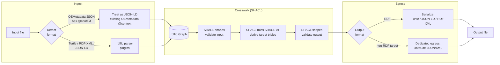
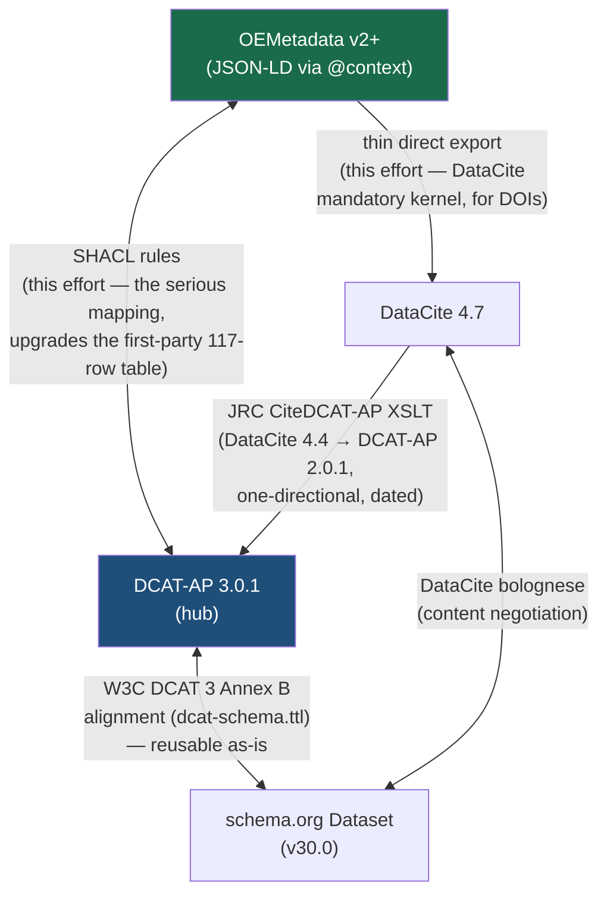
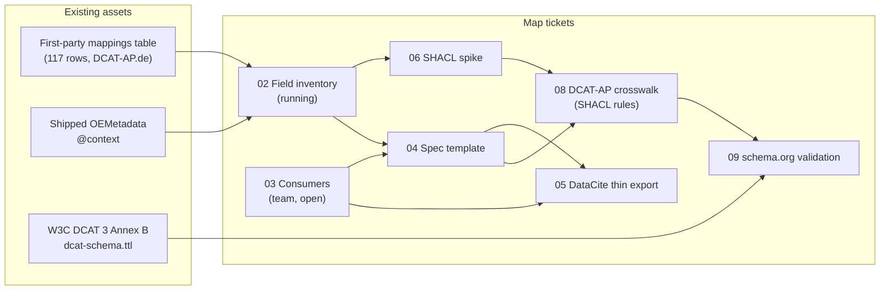

# Visualization — Crosswalk architecture and data flow

How the pieces of the metadata crosswalk work together. Companion to [[Design - RDF crosswalk pipeline]] and [[Metadata Crosswalk - Wayfinder Map]]. Status: reflects the decisions as of 2026-07-16.

## 1. The pipeline — how one record flows through

Notes:

- OEMetadata v2 records already carry `@context`, so they parse as JSON-LD directly — the pivot expression reuses that context (open point: verify its per-field coverage).
- The mapping logic lives entirely in **SHACL rules**; the code around it is generic plumbing.
- Runtime loss logging (reporting dropped fields during the crosswalk step) is **future work**.

## 2. The standards map — hub-and-spoke

Reading the picture:

- **Two mappings to build, not three**: the serious OEMetadata ↔ DCAT-AP leg (SHACL rules) and a thin OEMetadata → DataCite export. schema.org falls out of the hub via the W3C alignment.
- The **DataCite → DCAT-AP** direction has an existing (dated) JRC artifact; **DCAT-AP → DataCite exists nowhere**, which is why the thin direct export leg is unavoidable.
- Reverse directions (imports into OEMetadata) ride the same edges backwards; synthesis rules for required OEMetadata fields are still fog on the map.

## 3. How the effort's artifacts feed each other

Resolved so far: the crosswalk survey (versions + reusable artifacts) and the architecture decision (RDF-first with SHACL). Full status lives on the [[Metadata Crosswalk - Wayfinder Map]].